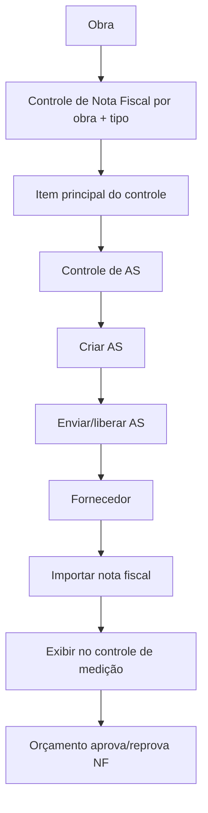
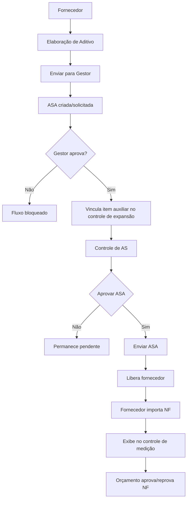

# Documento Técnico de Arquitetura
## Controle de notas fiscais, AS e ASA

**Código:** DTA-009  
**Versão:** 0.2  
**Data:** 2026-05-08  
**Status:** fluxo fiscal revisado

---

## 1. Objetivo

Documentar o fluxo atual de Controle de Nota Fiscal, AS, ASA e importação de nota fiscal.

Este documento também registra os relacionamentos verificados no código para garantir que AS e ASA sigam o mesmo modelo fiscal: primeiro localizam o Controle de Nota Fiscal da obra e depois vinculam o documento faturável ao item correto do controle.

---

## 2. Regras gerais

### 2.1 Controle de Nota Fiscal

O Controle de Nota Fiscal é identificado por:

```text
obra_id + tipo_unidade
```

Para o fluxo tratado neste documento, ASA entra apenas no controle de expansão/ampliação:

```text
tipo_unidade = expansão
```

O controle não deve ser criado manualmente por usuário em tela de criação. Ele deve existir por fluxo automático de obra/retrofit/expansão, conforme o tipo aplicável à obra.

### 2.2 Itens do controle

O conceito lógico "item do controle" tem duas implementações físicas:

| Conceito | Tabela | Documento faturável |
|---|---|---|
| Item principal | `controle_nota_fiscal_items` | AS |
| Item auxiliar/adicional | `controle_nota_fiscal_auxiliares` | ASA |

Regra de localização:

```text
AS  -> controle_nota_fiscal_items
ASA -> controle_nota_fiscal_auxiliares
```

AS e ASA não devem escolher controle por conta própria apenas por número de escopo, complemento ou adicional. O controle vem da obra e do tipo de unidade; o documento faturável localiza o item dentro desse controle.

---

## 3. Relacionamentos verificados

### 3.1 Modelo principal

| Origem | Relação | Destino | Implementação verificada |
|---|---:|---|---|
| Obra | 1:N | Controle de Nota Fiscal | `ControleNotaFiscal::obra()` |
| Controle de Nota Fiscal | 1:N | Item principal | `ControleNotaFiscal::itens()` |
| Controle de Nota Fiscal | 1:N | Item auxiliar | `ControleNotaFiscal::auxiliares()` |
| Item principal | 1:1 | AS | `ControleNotaFiscalItem::autorizacaoServico()` |
| AS | N:1 | Item principal | `AutorizacaoServico::controleNotaFiscalItem()` |
| Item auxiliar | 1:N físico | ASA | `ControleNotaFiscalAuxiliar::asas()` |
| ASA | N:1 | Item auxiliar | `Asa::controleNotaFiscalAuxiliar()` |
| AS | 1:N | Nota fiscal | `AutorizacaoServico::notasFiscais()` |
| ASA | 1:N | Nota fiscal | `Asa::notasFiscais()` |
| Nota fiscal | N:1 | AS | `ControleNotaFiscalNota::autorizacaoServico()` |
| Nota fiscal | N:1 | ASA | `ControleNotaFiscalNota::asa()` |

Observação: para o fluxo funcional, ASA deve ser tratada como 1:1 com o item auxiliar. O banco permite `ControleNotaFiscalAuxiliar::asas()` como relação `hasMany`, mas a regra operacional vigente usa `asas.controle_nota_fiscal_auxiliar_id` como vínculo direto da ASA aprovada/liberada.

### 3.2 Cadeias fiscais esperadas

```text
AS
-> controle_nota_fiscal_item_id
-> ControleNotaFiscalItem
-> controle_nota_fiscal_id
-> ControleNotaFiscal
-> obra_id + tipo_unidade
```

```text
ASA
-> controle_nota_fiscal_auxiliar_id
-> ControleNotaFiscalAuxiliar
-> controle_nota_fiscal_id
-> ControleNotaFiscal
-> obra_id + tipo_unidade
```

```text
Nota fiscal de AS
-> autorizacao_servico_id
-> AS
-> item principal
-> Controle de Nota Fiscal
```

```text
Nota fiscal de ASA
-> asa_id
-> ASA
-> item auxiliar
-> Controle de Nota Fiscal
```

### 3.3 Constraints e índices verificados

Há migration criando:

- `asas.controle_nota_fiscal_auxiliar_id` como FK nullable para `controle_nota_fiscal_auxiliares`;
- índice em `controle_nota_fiscal_auxiliares.controle_nota_fiscal_id`;
- unicidade em `controle_nota_fiscal_auxiliares` por `controle_nota_fiscal_id + numero_as + numero_complemento`;
- `controle_nota_fiscal_notas.autorizacao_servico_id` como FK nullable;
- `controle_nota_fiscal_notas.asa_id` como FK nullable;
- backfill dos vínculos diretos de AS, ASA e notas fiscais;
- remoção das colunas legadas de nota fiscal `controle_nota_fiscal_item_id` e `controle_nota_fiscal_auxiliar_id`.

Pontos ainda tratados por regra de aplicação:

- garantir que uma nota fiscal pertença a exatamente um documento faturável, AS ou ASA;
- garantir que ASA liberada no fluxo fiscal tenha `controle_nota_fiscal_auxiliar_id`;
- garantir unicidade funcional 1:1 entre ASA e item auxiliar no fluxo atual;
- garantir que Controle de Nota Fiscal seja único por `obra_id + tipo_unidade`.

---

## 4. Fluxo AS

### 4.1 Descrição

1. A obra possui Controle de Nota Fiscal de expansão/retrofit conforme o tipo aplicável.
2. O controle é preenchido com escopos ativos e não personalizados como itens principais.
3. O Controle de AS exibe os itens principais.
4. O orçamentista cria AS a partir de um item principal.
5. O orçamentista envia/libera a AS para o fornecedor.
6. O fornecedor importa nota fiscal vinculada à AS.
7. A nota fiscal aparece no controle de medição.
8. Orçamento aprova ou reprova a nota fiscal.

### 4.2 Diagrama



### 4.3 Regras de vínculo

| Etapa | Regra |
|---|---|
| Criar AS | `autorizacao_servicos.controle_nota_fiscal_item_id` aponta para o item principal |
| Enviar AS | item principal recebe liberação para fornecedor |
| Importar NF | nota recebe `autorizacao_servico_id` |
| Saldo | saldo deriva das notas da AS pelo item principal |

---

## 5. Fluxo ASA

### 5.1 Descrição atual

1. Fornecedor cria a "Elaboração de Aditivo".
2. A tela exibe ação "Enviar para Gestor".
3. Ao enviar para o gestor, a ASA é criada e enviada para aprovação do gestor.
4. Gestor aprova na visualização da ASA.
5. Ao aprovar, a ASA é vinculada ao Controle de Nota Fiscal de expansão da obra como item auxiliar.
6. A ASA fica pendente de aprovação do orçamento no Controle de AS.
7. No Controle de AS, o orçamentista executa a ação separada "Aprovar ASA".
8. Após aprovar, o Controle de AS passa a exibir a ação separada "Enviar ASA".
9. Ao enviar ASA, o item auxiliar é liberado para o fornecedor.
10. Fornecedor importa nota fiscal vinculada à ASA.
11. A nota fiscal aparece no controle de medição.
12. Orçamento aprova ou reprova a nota fiscal, seguindo o mesmo fluxo de aprovação de NF da AS.

### 5.2 Separação obrigatória das ações do orçamentista

No Controle de AS, aprovação e envio de ASA são ações diferentes:

| Ação | Efeito |
|---|---|
| Aprovar ASA | marca ASA como aprovada pelo orçamento e atualiza a elaboração de aditivo para `aprovado` |
| Enviar ASA | libera o item auxiliar para fornecedor e dispara o fluxo de envio |

O envio não pode aprovar implicitamente a ASA. A ação "Enviar ASA" só fica disponível depois da aprovação pelo orçamento.

### 5.3 Aprovação na tela da ASA

A visualização da ASA tem apenas a aprovação do gestor. O orçamentista não aprova ASA nessa tela.

Regra:

```text
Gestor aprova na ASA.
Orçamentista aprova no Controle de AS.
Orçamentista envia ASA no Controle de AS.
```

### 5.4 Diagrama



### 5.5 Regras de vínculo

| Etapa | Regra |
|---|---|
| Gestor aprova ASA | ASA muda para `Em aprovação do orçamento` |
| Vincular ao controle | sistema localiza controle por `obra_id + tipo_unidade = expansão` |
| Criar/atualizar item auxiliar | usa `controle_nota_fiscal_auxiliares` |
| Persistir vínculo direto | `asas.controle_nota_fiscal_auxiliar_id` recebe o item auxiliar |
| Aprovar no Controle de AS | ASA muda para `Aprovado`; elaboração muda para `aprovado` |
| Enviar no Controle de AS | item auxiliar recebe `liberado_para_fornecedor_at` |
| Importar NF | nota recebe `asa_id` |
| Saldo | saldo deriva das notas da ASA pelo item auxiliar |

---

## 6. Telas e responsabilidades

| Tela | Perfil | Responsabilidade |
|---|---|---|
| Controle de Nota Fiscal | Gestor | visualizar controle e medição |
| Controle de AS | Orçamentista | criar/enviar AS, aprovar ASA, enviar ASA |
| Elaboração de Aditivo | Fornecedor | solicitar aditivo e enviar para gestor |
| Visualização de ASA | Gestor | aprovar ou reprovar ASA como gestor |
| Meus controles de NF | Fornecedor | visualizar itens liberados e importar NF |
| Importação de NF | Fornecedor | importar nota para AS ou ASA liberada |
| Aprovação de NF | Orçamento | aprovar ou reprovar notas fiscais |

---

## 7. Matriz AS x ASA

| Critério | AS | ASA |
|---|---|---|
| Origem | Item principal do Controle de Nota Fiscal | Elaboração de Aditivo |
| Tabela do item | `controle_nota_fiscal_items` | `controle_nota_fiscal_auxiliares` |
| Documento faturável | `autorizacao_servicos` | `asas` |
| Vínculo direto | `autorizacao_servicos.controle_nota_fiscal_item_id` | `asas.controle_nota_fiscal_auxiliar_id` |
| Criação | Controle de AS | Enviar para Gestor na Elaboração de Aditivo |
| Aprovação antes de envio | não há aprovação de solicitação separada | gestor na ASA e orçamento no Controle de AS |
| Envio/liberação | Controle de AS | Controle de AS, após aprovação do orçamento |
| Importação de NF | após AS enviada | após ASA enviada/liberada |
| Vínculo da NF | `controle_nota_fiscal_notas.autorizacao_servico_id` | `controle_nota_fiscal_notas.asa_id` |
| Aprovação da NF | Orçamento | Orçamento |

---

## 8. Checklist de conformidade do fluxo atual

| Item | Situação |
|---|---|
| Criação manual de Controle de Nota Fiscal removida da resource | conforme |
| ASA vinculada ao controle de expansão por item auxiliar | conforme |
| ASA persiste `controle_nota_fiscal_auxiliar_id` | conforme |
| Gestor aprova ASA na tela da ASA | conforme |
| Orçamentista aprova ASA no Controle de AS | conforme |
| Envio de ASA separado da aprovação | conforme |
| Importação de NF adicional vinculada por `asa_id` | conforme |
| Notas adicionais derivam controle via ASA -> item auxiliar | conforme |
| Garantia DB de nota fiscal com exatamente um destino | pendente de constraint explícita |
| Garantia DB de Controle único por `obra_id + tipo_unidade` | precisa ser confirmada/garantida por constraint |
